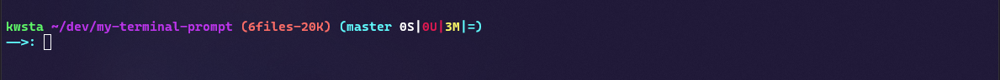
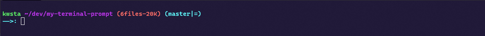

# My terminal prompt customization

## Installation

### Windows

Tested with Git Bash. It requires Git. Inside the Git Bash directory rename git-prompt.sh to git-prompt.backup and add [my git-prompt.sh file](git-prompt.sh). Run the following command with cmd administrator. Then open Git Bash to see the result.

```bash
# Rename currect git bash profile for backup

cd C:\Program Files\Git\etc\profile.d\ && rename git-prompt.sh git-prompt.backup

cd %homepath% && git clone https://github.com/KonstantinosAng/my-terminal-prompt && cd my-terminal-prompt && copy git-prompt.sh "C:\Program Files\Git\etc\profile.d\git-prompt.sh"

```

## Examples

<p align='center'>
  <p> (Time) User Current_Directory (No.Files - FileSize) </p>
  
  <p> Git Support (Branch - No.StagedFiles|No.UntrackedFiles|No.ModifiedFiles|Branch Status Compared To Github Repo (= Equal, > Ahead, < Behind, <> Diverged)) </p>
  
  <p> Python Virtual env support (Virtual Environment Name| Python version ) </p>
  
</p>